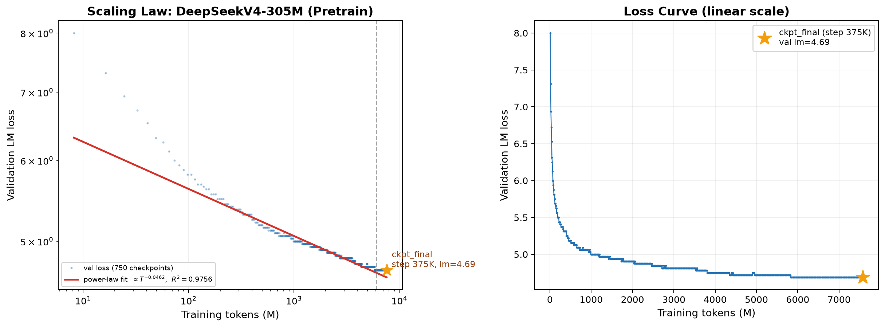
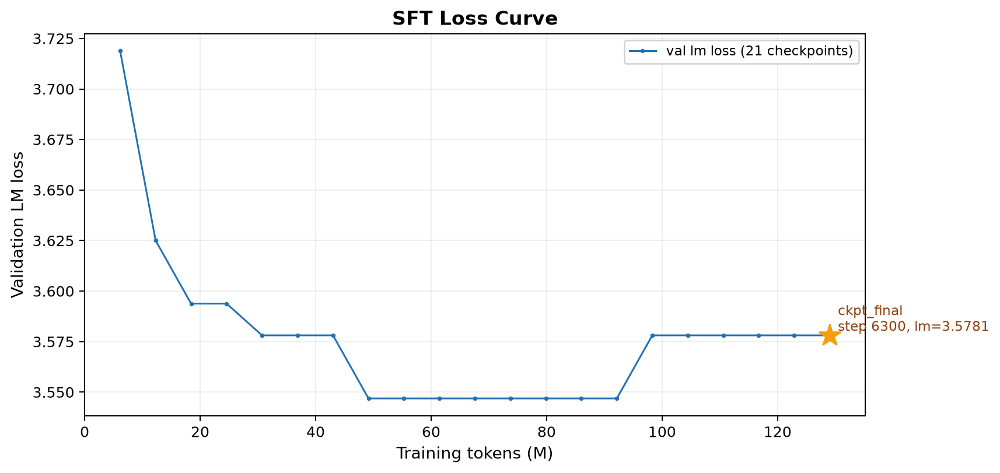

# Reproduction of DeepSeek-V4 (mini version)

从零复现 DeepSeek-V4 架构，使用 5×RTX 4090 DDP 训练一个 305M 参数的 mini 版本。

## 施工进度

| 模块 | 状态 | 说明 |
|------|------|------|
| BPE Tokenizer | ✅ 完成 | vocab_size=32000 |
| DeepSeekV4 模型 | ✅ 完成 | MoE + mHC + KV Compression + Indexer + MTP |
| Muon 优化器 | ✅ 完成 | 无 |
| AdamW 优化器 | ✅ 完成 | 无 |
| Loss (CE + Indexer KL) | ✅ 完成 | 无 |
| Benchmark | ✅ 完成 | DGX Spark + 4×4090 DDP 实测 |
| 数据预处理 | ✅ 完成 | 3,353,583,956 tokens |
| 训练脚本 | ✅ 完成 | 无 |
| 正式预训练 | ✅ 完成 | 305M 参数，~7.5B tokens |
| 指令微调 | ✅ 完成 | 65M tokens SFT 数据，~129M tokens 训练 |
| 后训练 | 👷 施工中 | 合成数据中…… |

## 架构

基于 DeepSeek-V4 技术报告实现，核心组件：

- **DSMoE** — 前几层用 HashGate 做确定性路由防止坍塌，后续层用 Sqrt(Softplus) Gate + learnable bias 做负载均衡
- **Manifold Hyper Connections (mHC)** — 多流残差连接，Sinkhorn-Knopp 双重随机矩阵混合
- **KV Compressor** — 按 ratio 压缩 KV cache，overlap 模式 (ratio=4) 用滑动窗口重叠
- **Lightning Indexer** — 可学习的稀疏注意力索引，KL loss 单独训练
- **Multi-Token Prediction (MTP)** — 额外预测头，加速收敛

详见 [src/deepseek.py](src/deepseek.py)。

## 硬件与配置

最终选择 **small (305M)** 在 4×RTX 4090 DDP 上训练：

| 配置 | d_model | n_layer | n_experts | 参数量 | 吞吐 |
|------|---------|---------|-----------|--------|------|
| tiny | 768 | 4 | 4 | 106M | 14,641 tok/s |
| **small** | **1024** | **8** | **6** | **305M** | **14,578 tok/s** |
| prefer | 1536 | 7 | 8 | 684M | OOM |

详见 [docs/benchmark_results.md](docs/benchmark_results.md) 和 [docs/training_plan.md](docs/training_plan.md)。

## 预训练结果

在 4×RTX 4090 DDP（后期扩至 5×RTX 4090）上完成 305M 模型 ~7.6B tokens 预训练。

**最终模型**：`checkpoints/pretrain_20260701/ckpt_0375000.pt`（step 375K, val lm = 4.69）

### 预训练 Scaling Law

验证 loss 遵循幂律 $L(T) \propto T^{\alpha}$，$\alpha = -0.0462$，$R^2 = 0.9756$：



- 蓝色散点：~7.6B tokens，loss 从 8.0 降至 4.69
- 红色实线：幂律拟合
- 黄色星标：ckpt_final（step 375K，~7.6B tokens，Chinchilla 比 = 24.8）

## 指令微调结果

在 5×RTX 4090 DDP 上完成 SFT，训练 6,378 steps（~129M tokens，约 2 epochs）。

**最终模型**：`checkpoints/sft/ckpt_final.pt`（step 6,378, val lm = 3.58）

### SFT Loss 曲线



- val lm 从 3.72 降至 3.58，约 2,400 steps 后迅速收敛

## 目录结构

```
src/          # 核心代码
  deepseek.py   — DeepSeekV4 模型（MoE, mHC, Compressor, Indexer, Attention, MTP）
  model.py      — 基础组件（Linear, RMSNorm, SwiGLU, RoPE, MiniLLM）
  tokenizer.py  — BPE Tokenizer（训练 + 编码/解码）
  optimizer.py  — Muon, AdamW, lr schedule, grad clip, param grouping
  loss.py       — Cross Entropy + Indexer KL Loss
  kernel.py     — Triton kernel（弃坑）
  dataset.py    — 数据加载
  trainer.py    — 训练循环 + DDP
scripts/      # 实验脚本
  pre_tokenization.py/sh  — 数据预处理
  train_tokenizer.py/sh   — Tokenizer 训练
  benchmark.py/ddp.py     — 吞吐基准测试
  verify_training.py      — 随机数据前向/反向代码验证
docs/         # 文档
  training_plan.md         — 训练计划与执行细节
  benchmark_results.md     — Benchmark 实测数据
config.py     # 模型配置定义
```

## 参考来源

- **课程**: [CS336: Language Modeling from Scratch](https://cs336.stanford.edu/spring2025/)
- **论文**:
  - DeepSeek [V3](https://arxiv.org/abs/2412.19437) / [V3.2](https://arxiv.org/abs/2512.02556) / [V4](https://huggingface.co/deepseek-ai/DeepSeek-V4-Pro/blob/main/DeepSeek_V4.pdf)（官方推理代码在 [HuggingFace](https://huggingface.co/deepseek-ai/DeepSeek-V4-Pro/tree/main)）
  - [DeepSeekMoE](https://arxiv.org/abs/2401.06066)
- **仓库**:
  - [mHC-manifold-constrained-hyper-connections](https://github.com/tokenbender/mHC-manifold-constrained-hyper-connections)
  - [KellerJordan/Muon](https://github.com/KellerJordan/Muon)

## 快速开始

```bash
# 运行 tokenizer
TOKENIZER_NAME=tokenizer VOCAB_SIZE=32000 CHUNK_SIZE=1073741824 bash scripts/train_tokenizer.sh

# 预处理 pretrain 数据集
bash scripts/pre_tokenization.sh

# Benchmark 单卡吞吐
python scripts/benchmark.py --config small

# 预训练
torchrun --nproc_per_node=5 scripts/pretrain.py \
    --data-train data/train_large.bin \
    --data-val data/valid.bin \
    --total-steps 375000 \
    --warmup-steps 2000 \
    --log-every 10 \
    --output-dir checkpoints/pretrain \
    --ckpt-every 5000

# SFT
orchrun --nproc_per_node=5 scripts/sft.py \
    --data-train /mnt/MiniDSv4/data/sft/train.pt \
    --data-val /mnt/MiniDSv4/data/sft/valid.pt \
    --wandb-project mini_deepseek_v4 \
    --base-model-path checkpoints/pretrain/ckpt_0375000.pt \
    --total-steps 6378 \
    --lr 1e-4 \
    --lr-min 1e-5 \
    --warmup-steps 300 \
    --val-every 300 \
    --ckpt-every 2000 \
    --output-dir checkpoints/sft

# 推理（预训练）
python scripts/inference.py checkpoints/pretrain/ckpt_0375000.pt  # 调试用，预训练model
python scripts/inference.py checkpoints/pretrain/ckpt_0375000.pt --interactive  # 交互式，预训练model
python scripts/inference.py checkpoints/pretrain/ckpt_0375000.pt --input prompts.txt  # 交互式，预训练model，batch预测
python scripts/inference.py checkpoints/pretrain/ckpt_0375000.pt --prompt "Once upon a time" # 预训练model，指定prompt
python scripts/inference.py checkpoints/sft/ckpt_final.pt --chat --prompt "Hello" #
```
